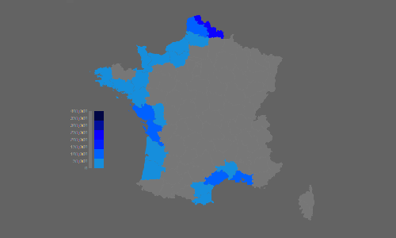

Projet de Data Vizualisation : visualisation de l'effet de la montée des eaux sur la population.

# Data visualization project: Impact of rising water levels

**Members**:
 - GUILLOTIN Louis 11603130
 - ALCARAZ Benoît 11608160
 - LA Sylvain 11506207
 - VILLAMAR Jose 11511502
 
## Description

The aim of this project is to raise public awareness of global warming.
To do that, we have created 2 visualization that show predictions of rising water levels, which is one of the consequences of this phenomenon.
THe first one is a bar chart that show the sea level in relation to the altitude of common cities.
The second is map a French departments that show the number of population affected by rising water levels for each one.

## Scoping document

The [scoping document](DocumentCadrage.pdf) is at the root of the project.
